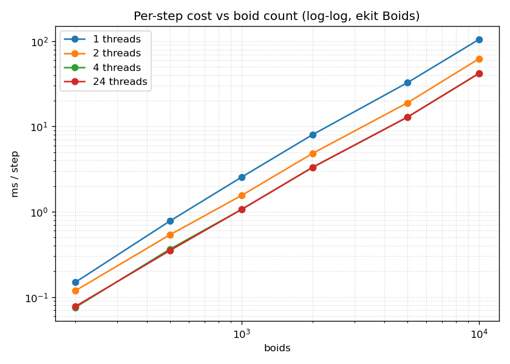
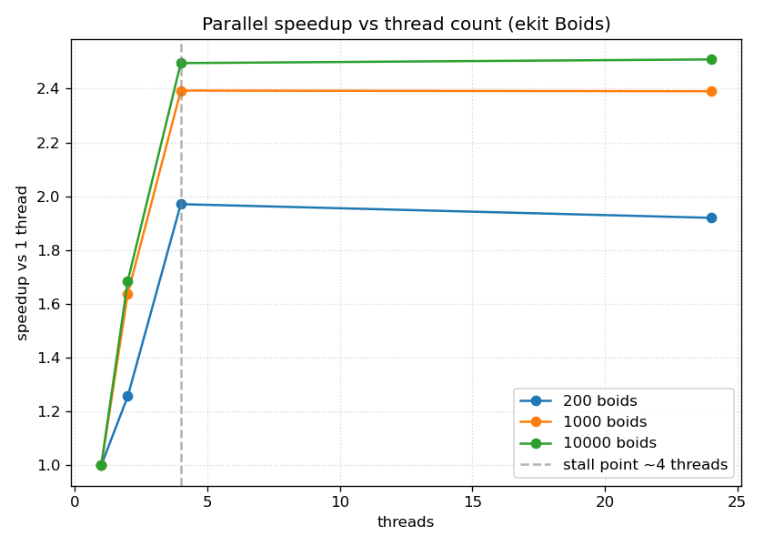

# Ekit

[English](README.md) | [简体中文](README.zh-CN.md)

**Ekit** is a header-only **C++20 ECS** (Entity-Component-System) library for game
engines. It combines sparse-set storage with an explicit, fluent API influenced by
C# LINQ and Unity DOTS. The project focuses on keeping common ECS operations readable
while avoiding type erasure and per-entity virtual dispatch in query iteration.

[EnTT](https://github.com/skypjack/entt) is a mature, feature-rich ECS library. Ekit is
smaller and covers a narrower feature set, with more emphasis on explicit registration
and fluent queries. The appropriate choice depends on the requirements of the project.

## Design philosophy

1. **Explicit over implicit**
   - Components must be declared by adding `EKIT_COMPONENT(T)` inside the struct and explicitly registered:
     `world.RegisterComponent<T>()`. No magic implicit registration.
   - Using an undeclared component produces a readable `static_assert`; using an
     unregistered one throws a clear `EkitException` telling you exactly what to call.
   - Systems declare their data dependencies (`Reads` / `Writes`) inside the class.

2. **Fluent & modern API (C# LINQ + Unity DOTS)**
   - PascalCase methods: `world.Create()`, `world.Query<Ts...>().ForEach(...)`.
   - Systems are classes with an `Execute(World&)` method, like Unity DOTS.

3. **Readable diagnostics and typed interfaces**
   - No template error storms: `static_assert` and `if constexpr` produce precise errors.
   - Entities are strong-typed, generation-based handles (never bare `uint32_t`).
   - The fluent query chain is composed at compile time, without type erasure or
     per-entity virtual calls.

4. **Core architecture**
   - Sparse-set storage, a dependency-aware parallel scheduler, named entities, and an
     event system provide building blocks for declarative auto-parallelization, editor
     integration, and network synchronization.

## Quick start

```cpp
#include <ekit/ekit.hpp>

struct Position {
    float x = 0.f;
    float y = 0.f;
    EKIT_COMPONENT(Position);
};

struct Velocity {
    float vx = 0.f;
    float vy = 0.f;
    EKIT_COMPONENT(Velocity);
};

int main() {
    ekit::World world;
    world.RegisterComponents<Position, Velocity>();

    auto ship = world.Create("ship");
    world.Add<Position>(ship, 10.f, 5.f);
    world.Add<Velocity>(ship, 2.f, 0.f);

    const float dt = 1.f / 60.f;
    world.Query<Position, Velocity>()
         .ForEach([dt](Position& p, Velocity& v) {
             p.x += v.vx * dt;
             p.y += v.vy * dt;
         });
}
```

## Write it like C#

For the 90% case, `World` exposes C#-style shortcuts so you do not have to spell
out a full fluent query:

```cpp
world.RegisterComponents<Position, Velocity>();

// Count entities that have all of these components
std::size_t movers = world.Count<Position, Velocity>();

// Update them in one call (C#: foreach (var e in view))
world.ForEach<Position, Velocity>([](Position& p, Velocity& v) {
    p.x += v.vx;
    p.y += v.vy;
});

// Parallel scalar update
ekit::ThreadPool pool(0); // 0 == hardware concurrency
world.ForEachParallel<Position, Velocity>(pool, [](Position& p, Velocity& v) {
    p.x += v.vx;
});

// SoA batch update (dense components only, raw aligned pointers)
world.ForEachBatch<Position, Velocity>([](Position* p, Velocity* v, std::size_t n) {
    for (std::size_t i = 0; i < n; ++i) {
        p[i].x += v[i].vx;
    }
});
```

Every shortcut is literally `Query<Ts...>().Method(...)`, so you can always drop
back to the full fluent chain (`Where` / `With` / `Without` / `Optional`) when you
need filters:

```cpp
world.Query<Position, Velocity>()
     .With<Renderable>()
     .Without<Disabled>()
     .Where([](Position&, Velocity&, Renderable&) { return true; })
     .ForEach([](ekit::Entity e, Position& p, Velocity& v, Renderable&) {
         // ...
     });
```

A runnable tour of the ergonomic surface lives in
[`examples/ergonomic.cpp`](examples/ergonomic.cpp); build it with the
`ekit_ergonomic` target.
## Features

- **Entity** — strong-typed, generation-based handle with dangling-handle safety
  (`Entity::Null`, `IsAlive`, automatic slot recycling with generation bumps).
- **Component** — POD structs declaring `EKIT_COMPONENT(T)` inside the class body; explicit
  `world.RegisterComponent<T>()`; sparse-set storage (cache-friendly dense arrays,
  swap-and-pop removal).
- **World** — entity create/destroy, component `Add / Emplace / Set / Get / TryGet /
  Has / Remove / Patch / Clear`, named entities, batch registration, `ClearAll`.
- **Query** — fluent queries with `Where / With / Without / Optional / ForEach / Count`,
  iterating the smallest matching storage:
  ```cpp
  world.Query<Position, Velocity>()
       .With<Renderable>()
       .Without<Disabled>()
       .Optional<Health>()
       .Where([](Position& p, Velocity& v, Renderable&, Health* hp) {
           return hp == nullptr || hp->hp > 0;
       })
       .ForEach([](ekit::Entity e, Position& p, Velocity& v, Renderable&, Health* hp) {
           // ...
       });
  ```
  Required components are passed by reference; optional components as pointers
  (`nullptr` when absent); the `Entity` handle is optional and comes first.
- **Data-parallel query & thread pool** — `ekit::ThreadPool` plus
  `Query::ForEachParallel(pool, fn)` split the smallest storage into chunks and run
  them concurrently (dynamic atomic work stealing, so per-entity cost stays balanced).
  The callback must only touch the entity's own components:
  ```cpp
  ekit::ThreadPool pool(0);                 // 0 == hardware concurrency
  world.Query<Position, Velocity>()
       .ForEachParallel(pool, [](Position& p, Velocity& v) { p.x += v.vx; });
  ```
- **System & Scheduler** — systems declare `Reads` / `Writes`; the scheduler builds a
  dependency DAG and executes independent systems in parallel on an internal thread pool:
  ```cpp
  struct GravitySystem {
      using Writes = ekit::TypeList<Velocity>;
      void Execute(ekit::World& world) {
          world.Query<Velocity>().ForEach([](Velocity& v) { v.vy -= 9.8f; });
      }
  };

  ekit::Scheduler scheduler(4);           // 0 == hardware concurrency
  scheduler.AddSystem(GravitySystem{})
           .AddSystem(MoveSystem{});
  scheduler.Run(world);                   // or RunSingleThreaded(world)
  ```
  A writer is ordered before every reader of the same component. Two writers of the
  same component do not form a cycle: they are serialized in registration order.
  A cycle is only reported when the declared dependencies genuinely contradict
  each other (e.g. A writes X / reads Y while B writes Y / reads X).
- **Event** — `world.Subscribe<T>(handler)` / `world.Emit<T>(args...)`:
  ```cpp
  struct HitEvent { int damage; ekit::Entity target; };
  ekit::EventSubscription sub = world.Subscribe<HitEvent>(
      [](const HitEvent& ev) { /* ... */ });
  world.Emit<HitEvent>(10, target);
  sub.Unsubscribe();
  ```

## Integration

Header-only, zero runtime dependencies:

- **CMake**
  ```cmake
  add_subdirectory(ekit)
  target_link_libraries(app PRIVATE ekit::ekit)
  ```
- **Manual**: add `include/` to your include path and `#include <ekit/ekit.hpp>`.

Requires C++20 (MSVC 19.29+, GCC 11+, Clang 14+).

## Case study: Boids

`examples/boids/` is a flocking simulation built on ekit. It demonstrates
explicit component registration, fluent queries, systems with `Reads/Writes`
declarations, the parallel scheduler (four boid-rule systems run concurrently),
spatial-hash neighbor queries, and a two-phase frame pipeline:

```bash
# Real-time window (GLFW + OpenGL, GPU rendering). GLFW is NOT part of this
# repo: clone https://github.com/chnnasn/glfw outside the repo, then:
cmake -S . -B build -DEKIT_GLFW_ROOT=E:/Github/glfw
cmake --build build --config Release --target ekit_boids_live
./build/examples/boids/Release/ekit_boids_live.exe --boids 220    # SPACE pause, R reset, ESC quit

# Headless: PPM frames -> animated GIF
cmake --build build --config Release --target ekit_boids
./build/examples/boids/Release/ekit_boids.exe --boids 220 --frames 180
powershell -ExecutionPolicy Bypass -File examples/boids/render.ps1 -Fps 30   # -> boids.gif
```

See [examples/boids/README.md](examples/boids/README.md) for details.

## Benchmarks

Full conditions, raw data and the analysis scripts live in
[`benchmarks/`](benchmarks/README.md). Headline results (Intel i7-14650HX, 24
threads, MSVC Release /O2, world 800x600, seed 20260810):

### Per-step cost as boid count increases

| from | to | x boids | x time | exponent |
| --- | --- | --- | --- | --- |
| 200 | 500 | 2.5x | 4.05x | 1.53 |
| 1000 | 2000 | 2.0x | 3.07x | 1.62 |
| 5000 | 10000 | 2.0x | 3.41x | 1.77 |

Per-step cost scales as n^1.5..n^1.8 and the exponent **rises toward 2 with
density**: the world is fixed, so doubling the boids doubles the density and
the number of neighbors per boid - the neighbor search is O(n x neighbors),
i.e. O(n^2) in the uniform-density limit. Throughput falls from ~2.7M boids/s
(200 boids) to ~285k boids/s (10000 boids).



### Parallel scaling by thread count

| boids | t2 | t4 | t24 |
| --- | --- | --- | --- |
| 200 | 1.32x | 1.94x | 1.96x |
| 10000 | 1.69x | 2.23x | 2.44x |

In these measurements, speedup changes little beyond **4 threads**. The dependency
graph has 4 parallel rule systems, while the grid rebuild and phase-2 chain are
serial; the observed speedup is therefore ~2.2-2.9x rather than 4x.



### ekit vs EnTT (same algorithm, EnTT v4)

In the scheduler-based benchmark, ekit measures ~15-25% faster with one thread,
while EnTT measures ~25-30% faster with four threads. The difference is
consistent with their query iteration and parallelization strategies. Both
implementations produce bit-identical simulation state for the tested workload.

The data-parallel path changes the multi-core picture. On Apple Silicon (14
threads, clang 21, -O2), `ekit_boids_bench_parallel` measures ~7.3-8.7x over
the single-threaded ekit baseline at 5000-10000 boids, while the scheduler path
stays ~2.2-2.3x. With the EnTT side switched to the same dynamic-chunking
parallel loop AND the same storage-driven component access (dense-array drive +
per-component sparse lookup, identical component set), data-parallel ekit is
~22-31% faster than EnTT v4 at 5000-10000 boids across 1/4/14 threads
(`ekit-dp/entt` ~0.69-0.75), narrowing to ~5-16% at 1000 boids.

## Building & testing

```bash
cmake -S . -B build
cmake --build build --config Release
ctest --test-dir build -C Release
```

## Unit tests

`tests/tests.cpp` ships with the library and is run via `ctest`:
**47 test cases / 304 assertions, all passing.** Coverage:

| area | tests |
| --- | --- |
| Entity - generation, stale-handle safety, slot recycling | 5 |
| Components - registration, CRUD, error paths, clear | 6 |
| Queries - ForEach, Where, With/Without/Optional, const refs | 5 |
| Parallel queries - ForEachParallel correctness, filters, deterministic writes | 3 |
| SoA batch queries - ForEachBatch / ForEachBatchParallel | 2 |
| World shortcuts - ForEach / ForEachParallel / ForEachBatch(Parallel) / Count | 3 |
| Named entities | 1 |
| Events - subscribe/emit, multiple handlers | 3 |
| Systems & Scheduler - dependency ordering, parallelism, writer serialization, genuine-cycle detection | 6 |
| Component declarations - traits, manual specialization | 2 |
| Sparse components - basic CRUD, parallel queries | 2 |
| Stream processing - ScratchSoa collect-then-batch | 3 |
| Regression - destroy-then-iterate, free-slot access, mutation during iteration, generation overflow, self-unsubscribe, scheduler recovery after a task exception | 6 |
| **Total** | **47 / 304** |

Run them with:

```bash
cmake -S . -B build
cmake --build build --config Release --target ekit_tests
./build/Release/ekit_tests.exe        # or: ctest --test-dir build -C Release
```

## Project layout

```
include/ekit/
  core.hpp        exceptions, TypeList, type ids
  entity.hpp      Entity (generation-based handle)
  component.hpp   EKIT_COMPONENT, Archetype (SoA) + ComponentStorage (sparse set)
  query.hpp       fluent Query (Where / With / Without / Optional / ForEach / ForEachBatch / ForEachParallel)
  stream.hpp      ScratchSoa<Ts...> collect-then-batch staging buffer
  parallel.hpp    reusable ThreadPool + chunked ParallelFor
  world.hpp       World, component CRUD, named entities, events, C#-style shortcuts
  system.hpp      system interface + Reads/Writes extraction
  scheduler.hpp   dependency-graph scheduler + thread pool
  ekit.hpp        unified entry point

examples/
  basic.cpp       classic system/query simulation
  ergonomic.cpp   the "write it like C#" tour
  boids/          GLFW boids case study + EnTT comparison
```
## Roadmap

- [x] Entity / Component / World core (sparse-set storage)
- [x] Fluent Query with `Where / With / Without / Optional`
- [x] System `Reads/Writes` + parallel Scheduler
- [x] Event system (`Subscribe` / `Emit`)
- [x] Archetype chunks (SoA) + stream/batch processing
- [x] Unit tests + benchmark vs `entt`
- [ ] CMake package config (`find_package(ekit)`)

## License

[MIT](LICENSE) © 2026 chnnasn
