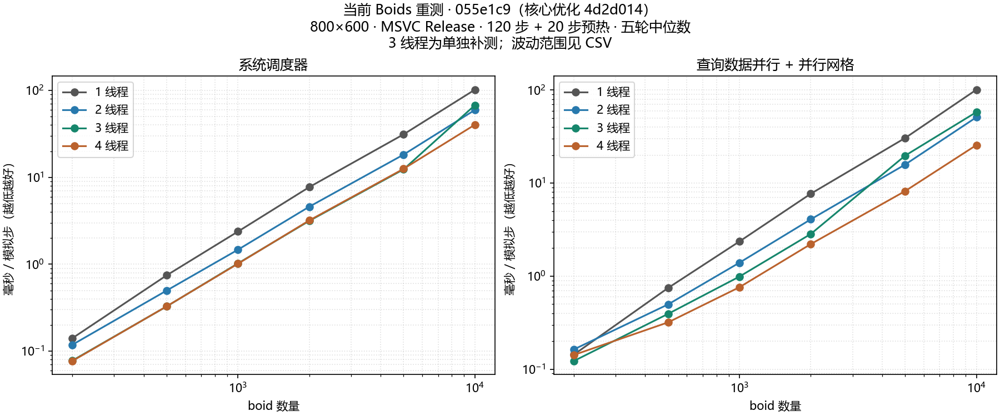
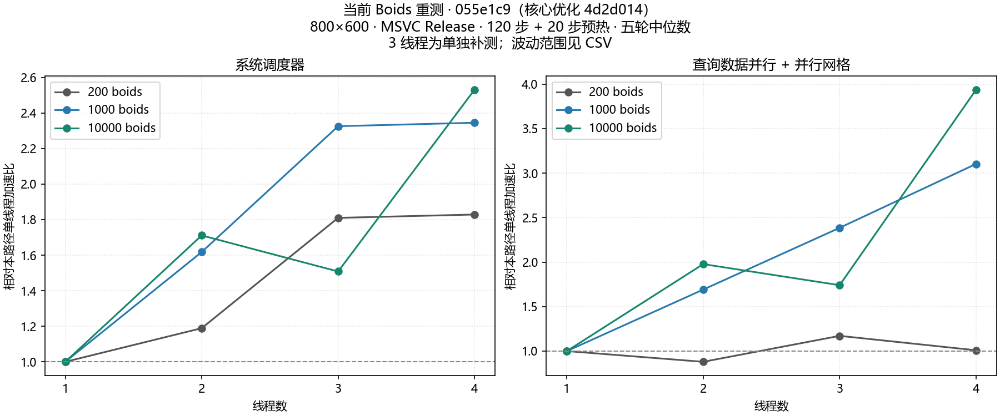

# Ekit

[English](README.md) | [简体中文](README.zh-CN.md)

**Ekit** 是一个面向游戏引擎、仅包含头文件的 **C++20 ECS**（实体-组件-系统）库。它结合稀疏集存储与受 C# LINQ 和 Unity DOTS 启发的显式流畅 API，侧重于提高常用 ECS 操作的可读性，并在查询迭代中避免类型擦除和逐实体虚函数调用。

[EnTT](https://github.com/skypjack/entt) 是一个成熟、功能丰富的 ECS 库。Ekit 规模较小，覆盖的功能范围也更窄，侧重显式注册和流畅查询。具体选择取决于项目需求。

## 设计理念

1. **显式优于隐式**
   - 组件必须在结构体中添加 `EKIT_COMPONENT(T)` 进行声明，并通过 `world.RegisterComponent<T>()` 显式注册，不进行隐式注册。
   - 使用未声明的组件会产生易读的 `static_assert`；使用未注册的组件会抛出清晰的 `EkitException`，并明确提示需要调用的方法。
   - 系统在类中声明自己的数据依赖（`Reads` / `Writes`）。

2. **流畅的现代 API（C# LINQ + Unity DOTS）**
   - 使用 PascalCase 方法，例如 `world.Create()`、`world.Query<Ts...>().ForEach(...)`。
   - 系统是带有 `Execute(World&)` 方法的类，风格类似 Unity DOTS。

3. **可读的诊断与类型化接口**
   - 避免模板错误刷屏：通过 `static_assert` 和 `if constexpr` 给出准确错误。
   - 实体采用强类型、带世代编号的句柄，而不是裸 `uint32_t`。
   - 流式查询链在编译期组合，不使用类型擦除或逐实体虚函数调用。

4. **核心架构**
   - 稀疏集存储、依赖感知的并行调度器、命名实体和事件系统，可作为声明式自动并行、编辑器集成和网络同步的基础组件。

## 快速开始

```cpp
#include <ekit/ekit.hpp>

struct Position {
    float x = 0.f;
    float y = 0.f;
    EKIT_COMPONENT(Position);
};

struct Velocity {
    float vx = 0.f;
    float vy = 0.f;
    EKIT_COMPONENT(Velocity);
};

int main() {
    ekit::World world;
    world.RegisterComponents<Position, Velocity>();

    auto ship = world.Create("ship");
    world.Add<Position>(ship, 10.f, 5.f);
    world.Add<Velocity>(ship, 2.f, 0.f);

    const float dt = 1.f / 60.f;
    world.Query<Position, Velocity>()
         .ForEach([dt](Position& p, Velocity& v) {
             p.x += v.vx * dt;
             p.y += v.vy * dt;
         });
}
```

## 像写 C# 一样顺手

对于 90% 的常见场景，`World` 直接提供 C# 风格的快捷方法，不必每次都拼出完整的流式查询：

```cpp
world.RegisterComponents<Position, Velocity>();

// 统计拥有全部这些组件的实体数量
std::size_t movers = world.Count<Position, Velocity>();

// 一次调用完成更新（C#：foreach (var e in view)）
world.ForEach<Position, Velocity>([](Position& p, Velocity& v) {
    p.x += v.vx;
    p.y += v.vy;
});

// 并行标量更新
ekit::ThreadPool pool(0); // 0 == 硬件并发数
world.ForEachParallel<Position, Velocity>(pool, [](Position& p, Velocity& v) {
    p.x += v.vx;
});

// SoA 批处理更新（仅限 dense 组件，直接拿到对齐的裸指针）
world.ForEachBatch<Position, Velocity>([](Position* p, Velocity* v, std::size_t n) {
    for (std::size_t i = 0; i < n; ++i) {
        p[i].x += v[i].vx;
    }
});
```

每个快捷方法都等价于 `Query<Ts...>().Method(...)`，因此需要过滤时随时可以退回完整的
流式链（`Where` / `With` / `Without` / `Optional`）：

```cpp
world.Query<Position, Velocity>()
     .With<Renderable>()
     .Without<Disabled>()
     .Where([](Position&, Velocity&, Renderable&) { return true; })
     .ForEach([](ekit::Entity e, Position& p, Velocity& v, Renderable&) {
         // ...
     });
```

完整的可运行示例见[`examples/ergonomic.cpp`](examples/ergonomic.cpp)，使用
`ekit_ergonomic` 目标构建。
## 功能

- **实体（Entity）**：强类型、带世代编号的句柄，可安全处理失效句柄（`Entity::Null`、`IsAlive`，槽位回收时自动递增世代编号）。
- **组件（Component）**：在类体内通过 `EKIT_COMPONENT(T)` 声明的 POD 结构体；使用 `world.RegisterComponent<T>()` 显式注册为 dense archetype SoA 存储，或使用 `world.RegisterSparseComponent<T>()` 注册为按类型的稀疏集（缓存友好的密集数组与交换删除）。
- **世界（World）**：实体创建与销毁、组件 `Add / Emplace / Set / Get / TryGet / Has / Remove / Patch / Clear`、命名实体、批量注册和 `ClearAll`。
- **查询（Query）**：支持 `Where / With / Without / Optional / ForEach / Count` 的流畅查询，并从符合条件的存储中最小的那个开始迭代：
  ```cpp
  world.Query<Position, Velocity>()
       .With<Renderable>()
       .Without<Disabled>()
       .Optional<Health>()
       .Where([](Position& p, Velocity& v, Renderable&, Health* hp) {
           return hp == nullptr || hp->hp > 0;
       })
       .ForEach([](ekit::Entity e, Position& p, Velocity& v, Renderable&, Health* hp) {
           // ...
       });
  ```
  必需组件以引用传入，可选组件以指针传入（不存在时为 `nullptr`）；`Entity` 句柄是可选参数，存在时必须位于首位。
- **数据并行查询与线程池（Data-parallel Query & ThreadPool）**：`ekit::ThreadPool` 配合
  `Query::ForEachParallel(pool, fn)` 把最小存储切分成多个分块并发执行（动态原子取块，负载均衡）。
  回调只允许读写“当前实体自己的组件”：
  ```cpp
  ekit::ThreadPool pool(0);                 // 0 == 硬件并发数
  world.Query<Position, Velocity>()
       .ForEachParallel(pool, [](Position& p, Velocity& v) { p.x += v.vx; });
  ```
- **系统与调度器（System & Scheduler）**：系统声明 `Reads` / `Writes`；调度器构建依赖 DAG，并通过内部线程池并行执行相互独立的系统：
  ```cpp
  struct GravitySystem {
      using Writes = ekit::TypeList<Velocity>;
      void Execute(ekit::World& world) {
          world.Query<Velocity>().ForEach([](Velocity& v) { v.vy -= 9.8f; });
      }
  };

  ekit::Scheduler scheduler(4);           // 0 表示使用硬件并发数
  scheduler.AddSystem(GravitySystem{})
           .AddSystem(MoveSystem{});
  scheduler.Run(world);                   // 也可以使用 RunSingleThreaded(world)
  ```
  写入者会排在读取同一组件的读取者之前。两个写入同一组件的系统**不再形成依赖环**：它们按注册顺序串行执行。只有当声明的依赖真正互相矛盾（例如 A 写 X / 读 Y，而 B 写 Y / 读 X）时才会报告依赖环。
- **事件（Event）**：使用 `world.Subscribe<T>(handler)` / `world.Emit<T>(args...)`：
  ```cpp
  struct HitEvent { int damage; ekit::Entity target; };
  ekit::EventSubscription sub = world.Subscribe<HitEvent>(
      [](const HitEvent& ev) { /* ... */ });
  world.Emit<HitEvent>(10, target);
  sub.Unsubscribe();
  ```

## 集成

仅包含头文件、零运行时依赖：

- **CMake**
  ```cmake
  add_subdirectory(ekit)
  target_link_libraries(app PRIVATE ekit::ekit)
  ```
- **手动**：将 `include/` 加入包含路径，然后 `#include <ekit/ekit.hpp>`。

需要 C++20（MSVC 19.29+、GCC 11+、Clang 14+）。

## 案例：Boids

`examples/boids/` 是一个基于 ekit 构建的鸟群模拟，演示了显式组件注册、流畅查询、带 `Reads/Writes` 声明的系统、并行调度器（四条规则系统并发执行）、空间哈希近邻查询和二阶段帧管线：

```bash
# 实时窗口（GLFW + OpenGL，GPU 渲染）。GLFW 不在本仓库内：
# 先在仓库外克隆 https://github.com/chnnasn/glfw，然后：
cmake -S . -B build -DEKIT_GLFW_ROOT=E:/Github/glfw
cmake --build build --config Release --target ekit_boids_live
./build/examples/boids/Release/ekit_boids_live.exe --boids 220    # SPACE 暂停, R 重置, ESC 退出

# 无头模式：PPM 帧 -> 动画 GIF（无需 GLFW）
cmake --build build --config Release --target ekit_boids
./build/examples/boids/Release/ekit_boids.exe --boids 220 --frames 180
powershell -ExecutionPolicy Bypass -File examples/boids/render.ps1 -Fps 30   # -> boids.gif
```

详见 [examples/boids/README.zh-CN.md](examples/boids/README.zh-CN.md)。

## 基准测试

**根据用户提供的最新重测结论，ekit 在本轮遍历测试中已追平或超过 EnTT，主要优化重点转向随机访问和实体创建**，
同时保持稀疏组件增删、实体销毁的优势，以及引用有效性、生命周期与查询语义。
该轮重测的确切版本与逐轮数据尚未归档到本仓库；下方带版本的 EnTT 表格仍保留此前对照结果。

### 当前优化：`4d2d014`

[分页存储报告](benchmarks/random_create.zh-CN.md)对照 `43e18e1` 与提交为 `4d2d014` 的实现：
10 万实体、Windows x64、MSVC Release，固定逻辑 CPU 0，六轮舍弃首轮，取其余五轮中位数。
稀疏与密集场景使用独立进程，并交替新旧版本运行顺序。

| 稀疏操作 | 优化前（ms） | 优化后（ms） | 耗时减少 |
| --- | ---: | ---: | ---: |
| 创建实体并添加两个组件 | 10.80 | 7.25 | 33% |
| 遍历更新 200 次 | 56.44 | 37.22 | 34% |
| 随机读取 10 轮 | 24.55 | 10.72 | 56% |
| 组件添加、移除 10 轮 | 15.81 | 10.98 | 31% |
| 销毁全部实体 | 2.59 | 1.49 | 43% |

这是 ekit 新旧版本对照，不是新的 EnTT 耗时比。稀疏分页存储在追加和预留容量时保持引用有效，
删除后保留页面供复用；交换删除仍可能使引用失效。密集销毁本轮慢约 0.39 ms，完整报告保留了这一结果。
继续按组件用途选择存储，迁移 Transform 等组件前先审计外部引用。

[此前基准报告](benchmarks/ecs_comparison.zh-CN.md)收录下述原生 ECS 与 SceneWorld 结果；
[基准索引](benchmarks/README.zh-CN.md)提供原始数据、复现脚本，并区分各版本对照与历史 Boids 测试。

### 此前 ekit 与 EnTT 对比：原生 ECS 与引擎接入

测试版本为 **ekit `3fcda56`**，引擎适配层为 **`dev_ekit` 分支的 `01f923f`**；对照库为 TomCat `main` 分支使用的 **EnTT 3.15.0**。
测试环境与接入代码见 [TomCat_Engine / dev_ekit](https://github.com/chnnasn/TomCat_Engine/tree/dev_ekit)。

测试在 **Intel Core i7-14650HX、Windows x64、MSVC Release** 环境下执行，**单线程运行六轮，舍弃首轮，取其余五轮中位数**。

以下为 **10 万实体**的原生 ECS 测试结果，单位为毫秒，越低越好。

| 测试项目 | EnTT | ekit 稀疏存储 | ekit 相对表现 |
| --- | ---: | ---: | --- |
| 创建实体并添加两个组件 | 4.07 | 8.80 | 耗时 2.17 倍 |
| 双组件遍历更新 200 次 | 35.85 | 49.19 | 耗时增加 37% |
| 随机读取 10 轮 | 3.72 | 13.97 | 耗时 3.75 倍 |
| 组件添加、移除 10 轮 | 24.93 | 12.86 | 耗时减少 48% |
| 销毁全部实体 | 5.80 | 1.69 | 耗时减少 71% |

稀疏遍历相对 EnTT 的耗时差距，三次测试依次为 **7.28 倍 → 3.26 倍 → 1.37 倍**。
查询优化取得了明显效果，但随机读取和实体创建仍落后于 EnTT。

**密集存储**完成相同的 200 次遍历耗时 **13.74 ms**，相比 EnTT 的 35.85 ms，耗时减少约 **62%**。
但其组件增删耗时为 EnTT 的 **6.55 倍**，适合结构稳定、频繁遍历的数据，不能据此认定密集存储全面更优。

`dev_ekit` 新增的 **`SceneWorld::ForEach`** 使用该分支实际固定的依赖进行单独补测，不能将其依赖版本等同于上面的原生 ECS 测试版本：

| 第二个组件覆盖率 | EnTT | SceneWorld | 耗时差距 |
| --- | ---: | ---: | --- |
| 1% | 0.455 ms | 0.575 ms | 多约 26% |
| 10% | 3.991 ms | 5.786 ms | 多约 45% |
| 100% | 35.687 ms | 41.959 ms | 多约 18% |

以上均为 **10 万实体、200 次更新**，计时不包含创建和编辑器拾取管理等开销。

在本次测试范围内，ekit 的稀疏组件增删、实体销毁快于当前 EnTT 对照，稀疏遍历已明显接近 EnTT；
密集遍历在两个简单数据组件的用例中超过 EnTT。下一步优先优化随机访问和创建开销，
同时保持组件引用有效性、生命周期与查询语义。**这些结果不能直接推广到复杂组件、多线程系统或整个引擎帧率。**

### 当前 Boids 重测

2026-09-21 已重跑当前 `055e1c9`（核心优化 `4d2d014`）的 Boids。i7-14650HX、Windows x64、MSVC Release，800×600、种子 20260810，20 步预热 + 120 步计时，六轮舍弃首轮，取五轮中位数。主图为 1/2/3/4 线程，24 线程另列；3 线程为单独补跑。

10,000 boids，每步毫秒，越低越好：

| 路径 | 1 线程 | 2 线程 | 3 线程 | 4 线程 | 24 线程 |
| --- | ---: | ---: | ---: | ---: | ---: |
| 系统调度器 | 102.12 | 59.69 | 67.71 | 40.35 | 40.31 |
| 查询数据并行 + 网格 | 100.90 | 51.02 | 57.97 | 25.63 | 8.49 |





加速比相对各路径自身单线程；两条路径的扩展表现应分别判断。Boids 使用密集组件，不能直接套用稀疏分页收益。所有已运行并行配置的位置校验和检查通过；计时不包含创建或渲染。本轮没有重跑 EnTT 或旧版，不能将跨日期变化视为版本提速。

[完整报告、原始数据与复现方法](benchmarks/boids_retest.zh-CN.md).

历史 Boids 和 EnTT v4 对照保留在[基准索引](benchmarks/README.zh-CN.md)，旧曲线与 GIF 不代表本轮结果。

## 构建与测试

```bash
cmake -S . -B build
cmake --build build --config Release
ctest --test-dir build -C Release
```

## 单元测试

`tests/tests.cpp` 随库一起发布，通过 `ctest` 运行：**49 个测试用例 / 307 项断言，全部通过**。覆盖范围：

| 领域 | 用例数 |
| --- | --- |
| 实体 - 世代编号、失效句柄安全、槽位回收 | 5 |
| 组件 - 注册、增删改查、错误路径、清除 | 6 |
| 查询 - ForEach、Where、With/Without/Optional、const 引用 | 6 |
| 并行查询 - ForEachParallel 正确性、过滤、确定性写入 | 3 |
| SoA 批查询 - ForEachBatch / ForEachBatchParallel | 3 |
| World 快捷方法 - ForEach / ForEachParallel / ForEachBatch(Parallel) / Count | 3 |
| 命名实体 | 1 |
| 事件 - 订阅/派发、多个处理器 | 3 |
| 系统与调度器 - 依赖排序、并行、双写串行、真实环检测 | 6 |
| 组件声明 - 特性、手动特化 | 2 |
| 稀疏组件 - 基础 CRUD、并行查询 | 2 |
| 流处理 - ScratchSoa 收集后批处理 | 3 |
| 回归 - 销毁后遍历、空闲槽访问、遍历中改组件、世代溢出、自退订、任务异常后调度器恢复 | 6 |
| **合计** | **49 / 307** |

运行方式：

```bash
cmake -S . -B build
cmake --build build --config Release --target ekit_tests
./build/Release/ekit_tests.exe        # 或 ctest --test-dir build -C Release
```

## 项目结构

```
include/ekit/
  core.hpp        异常、TypeList、类型 ID
  entity.hpp      Entity（带世代编号的句柄）
  component.hpp   EKIT_COMPONENT、Archetype（SoA）+ ComponentStorage（稀疏集）
  query.hpp       流畅 Query（Where / With / Without / Optional / ForEach / ForEachBatch / ForEachParallel）
  stream.hpp      ScratchSoa<Ts...> 收集后批处理暂存缓冲
  parallel.hpp    可复用 ThreadPool + 分块 ParallelFor
  world.hpp       World、组件 CRUD、命名实体、事件、C# 风格快捷方法
  system.hpp      系统接口 + Reads/Writes 提取
  scheduler.hpp   依赖图调度器 + 线程池
  ekit.hpp        统一入口

examples/
  basic.cpp       经典系统/查询模拟
  ergonomic.cpp   "像写 C# 一样"的完整示例
  boids/          GLFW boids 案例 + EnTT 对比
```
## 路线图

- [x] Entity / Component / World 核心（dense archetype SoA + 稀疏集存储）
- [x] 流畅 Query（`Where / With / Without / Optional`）
- [x] 系统 `Reads/Writes` + 并行 Scheduler
- [x] 事件系统（`Subscribe` / `Emit`）
- [x] Archetype 分块（SoA）+ 流处理/批处理
- [x] 单元测试 + 与 `entt` 对比基准
- [ ] CMake 包配置（`find_package(ekit)`）

## 许可证

[MIT](LICENSE) © 2026 chnnasn

## 稀疏存储与批量创建容量

资源组件和频繁增删的组件继续使用 `RegisterSparseComponent<T>()`。当前实现按 2 的幂次元素数量分页，
每页目标大小为 4 KiB；大于该大小的类型每页放一个元素。追加和预留容量不会移动已有组件。
删除会立即执行析构，但保留页面容量供复用；交换删除仍可能使被删除组件和被移入的池尾组件引用失效。
`ClearComponent`、`ClearAll` 或存储析构会释放组件页。
这是以峰值容量保留及每池末页空余空间，换取更少的反复分配。

```cpp
world.RegisterSparseComponent<Position>();
world.RegisterSparseComponent<Velocity>();
world.ReserveEntities(100000);
world.ReserveSparseComponent<Position>(100000);
world.ReserveSparseComponent<Velocity>(100000);
```

`ReserveEntities` 预留实体索引与空 archetype 的容量；`ReserveSparseComponent<T>` 预留组件池的
实体和稀疏索引数组，并分配尚未构造组件的页面。先预留实体容量，才能为稀疏索引预留相应范围。
`ReserveArchetype<Ts...>` 为一个精确的密集组件组合预留容量，连续 Add 时也要考虑中间组合。
密集存储仍要求平凡可复制类型；迁移 Transform 等组件前需要审计外部引用，不能统一迁移。

详见[随机访问与创建优化记录](benchmarks/random_create.zh-CN.md)。上方历史 EnTT 对比仍对应其标明的版本，
不会因本轮优化而自动更新。
