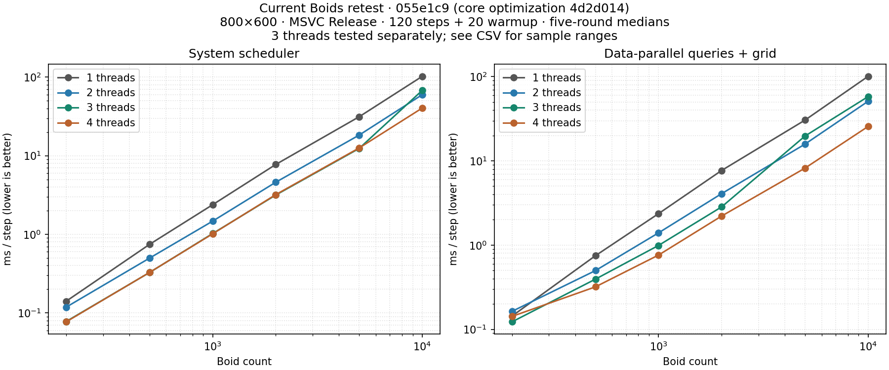
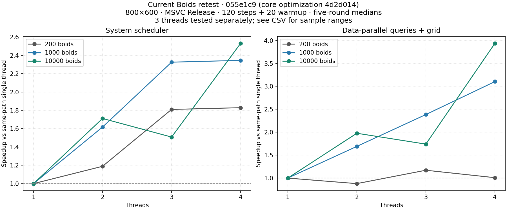

# ekit benchmarks

[English](README.md) | [简体中文](README.zh-CN.md)

## Current performance status

The latest user-reported retest places ekit at or ahead of EnTT in the tested
traversal workloads; random access and creation remain the main priorities.
Its exact revisions and per-round data have not yet been archived here.

The reproducible [paged storage report](random_create.md) covers `43e18e1` →
`4d2d014`, comparing ekit versions under the same conditions, not against EnTT:

| Sparse operation | Before → after (ms) | Time reduction |
| --- | ---: | ---: |
| Create with two components | 10.80 → 7.25 | 33% |
| Traversal, 200 passes | 56.44 → 37.22 | 34% |
| Random reads, 10 passes | 24.55 → 10.72 | 56% |
| Add/remove, 10 rounds | 15.81 → 10.98 | 31% |
| Destroy all | 2.59 → 1.49 | 43% |

100,000 entities, Windows x64, MSVC Release, logical CPU 0; six rounds, discard
the first, report five-round medians. Versions alternate and storage modes run
in separate processes. The report includes raw data and the reproduction script.
Pages retain peak capacity until clear/destruction; dense destruction was about
0.39 ms slower in this run. Keep storage choices component-specific and audit
references before migrating Transform. Preserve reference, lifetime and query semantics.

## Earlier ECS comparison

The [full report](ecs_comparison.md) compares ekit `3fcda56` and TomCat adapter
`01f923f` with EnTT 3.15.0. Test environment:
[TomCat_Engine / dev_ekit](https://github.com/chnnasn/TomCat_Engine/tree/dev_ekit).
Intel Core i7-14650HX, Windows x64, MSVC Release, single thread, six rounds with
the first discarded and the remaining five summarized by their median.

For 100,000 entities, sparse traversal takes 49.19 ms versus EnTT's 35.85 ms
(1.37×), random reads 13.97 versus 3.72 ms, and creation 8.80 versus 4.07 ms.
Sparse churn takes 48% less time and destruction 71% less. Dense traversal takes
13.74 ms, but dense churn costs 6.55× EnTT. SceneWorld::ForEach takes 0.575,
5.786 and 41.959 ms at 1%, 10% and 100% coverage, respectively, using its pinned
dependency. These are workload-specific results, not whole-engine frame rates.

## Report index

| Report | Versions / scope |
| --- | --- |
| [Current Boids retest](boids_retest.md) | `055e1c9`; scheduler + data-parallel, 1/2/3/4/24 threads |
| [Paged storage and creation](random_create.md) | `43e18e1` → `4d2d014`; local optimization, not a new EnTT comparison |
| [Archived EnTT comparison](ecs_comparison.md) | ekit `3fcda56`, adapter `01f923f`, EnTT 3.15.0; supplied retest |
| [Sparse query coverage](sparse_query.md) | `c212e60` → `3e0daa8`; local microbenchmark |
| [Specialized access paths](access_paths.md) | `3e0daa8` → `3fcda56`; local microbenchmark |
| [Historical TomCat adapter audit](tomcat_integration.md) | Adapter `5a89e22`, before ForEach; View/Get comparison |
| Historical Boids data below | `227ea33`; separate simulation and parallelism settings |

The reports retain their own raw-data links and methods. The supplied latest
retest has no per-round raw output checked into this repository yet.

## Current Boids retest

Current `055e1c9` Boids (core optimization `4d2d014`) was rerun on 2026-09-21: i7-14650HX, Windows x64, MSVC Release, 800×600, seed 20260810, 20 warmup + 120 timed steps, five-round medians after discarding the first of six rounds. Primary charts cover 1/2/3/4 threads; 24 threads is listed separately. Three threads was a supplemental run.

10,000 boids, milliseconds per step; lower is better:

| Path | 1 thread | 2 threads | 3 threads | 4 threads | 24 threads |
| --- | ---: | ---: | ---: | ---: | ---: |
| System scheduler | 102.12 | 59.69 | 67.71 | 40.35 | 40.31 |
| Data-parallel queries + grid | 100.90 | 51.02 | 57.97 | 25.63 | 8.49 |





Speedups use each path's own single-thread median; interpret the two paths separately. Boids uses dense components, so sparse paging gains do not directly transfer. Position checksum checks passed for all tested parallel configurations; timings exclude creation and rendering. Neither EnTT nor the old revision was rerun, so cross-date changes do not establish version speedups.

[Full report, raw data and reproduction](boids_retest.md).

## Historical Boids benchmark

Raw data, test conditions and analysis for the ekit Boids benchmark and the
ekit vs EnTT comparison. Generated on **2026-08-14**.

## Code version

- Git commit: `227ea33` (`227ea33c7c629b07da2e858dc6376d17fba0dc52`)
  "Polish C#-like ergonomic API, dual storage, stream processing and docs"
- Benchmark sources: `examples/boids/bench.cpp` (ekit Boids),
  `examples/boids/compare_bench.cpp` + `examples/boids/entt_impl.hpp`
  (ekit vs EnTT), `examples/boids/boids.hpp` (simulation core)
## Test conditions

| item | value |
| --- | --- |
| CPU | Intel Core i7-14650HX (16 cores / 24 threads) |
| OS | Windows 10/11 x64 |
| Compiler | MSVC 19.50 (VS 2026), `/O2`, C++20, Release x64 |
| World | 800 x 600 |
| Seed | 20260810 |
| Algorithm | separation / alignment / cohesion / bounds rules, uniform spatial grid (cell = neighbor radius 48), **cells sorted by entity id** so neighbor accumulation is deterministic |

`ekit_boids_bench` (single-library):

| | |
| --- | --- |
| boid counts | 200, 500, 1000, 2000, 5000, 10000 |
| thread counts | 1, 2, 4, 24 |
| timed steps | 120 (+ 20 warmup) |

`ekit_entt_compare` (EnTT v4 vs ekit, same algorithm):

| | |
| --- | --- |
| boid counts | 200, 1000, 5000, 10000 |
| thread counts | 1, 2, 3, 4 |
| timed steps | 30 (+ 10 warmup) |
| verification | both implementations produce bit-identical state (`state identical: YES`) |

> Variance: single-run measurements on a shared machine; expect +/-10-30% run
> to run. Compare relative ratios, not absolute values.

## Files

| file | description |
| --- | --- |
| `ekit_boids_bench_raw.txt` | raw console output of the ekit Boids benchmark |
| `ekit_boids_bench.csv` | same data, machine readable |
| `entt_vs_ekit_raw.txt` | raw console output of the ekit vs EnTT comparison |
| `chart_cost_vs_boids.png` | ms/step vs boid count (log-log) |
| `chart_speedup_vs_threads.png` | speedup vs thread count |
| `chart_throughput.png` | throughput (k boids/s) vs boid count |
| `analyze.py` | script that parses the raw data and regenerates the CSV/charts |

## Analysis

### Per-step cost vs boid count

Measured at 4 threads (ms/step):

| from | to | x boids | x time | exponent |
| --- | --- | --- | --- | --- |
| 200 | 500 | 2.5x | 4.82x | 1.72 |
| 500 | 1000 | 2.0x | 2.91x | 1.54 |
| 1000 | 2000 | 2.0x | 3.14x | 1.65 |
| 2000 | 5000 | 2.5x | 3.86x | 1.47 |
| 5000 | 10000 | 2.0x | 3.26x | **1.71** |

The cost grows with exponent ~1.5-1.7 (between linear and quadratic) and the
exponent **rises toward 2 as density increases**. Cause: the world size is
fixed, so doubling the boids doubles the density, which doubles the *number of
neighbors per boid*; the neighbor search is O(n x neighbors), i.e. O(n^2) in
the uniform-density limit. The curve is a decline of throughput: 200 boids run
at ~2.65M boids/s (4 threads) but only ~238k boids/s at 10000.

### Parallel scaling by thread count

| boids | t2 | t4 | t24 |
| --- | --- | --- | --- |
| 200 | 1.26x | 1.97x | 1.92x |
| 1000 | 1.64x | 2.39x | 2.39x |
| 10000 | 1.69x | 2.50x | 2.51x |

In these measurements, speedup changes little beyond **4 threads**. The
dependency graph has 4 parallel rule systems in phase 1, while the spatial grid
rebuild and the 2-system phase-2 chain are serial. The observed range of
~2.0-2.5x is consistent with that serial work and load imbalance among the 4
rules (alignment and cohesion scan more neighbors than separation).

### ekit vs EnTT (same algorithm, EnTT v4)

- 1 thread: ekit is ~20% slower than EnTT (`ekit/entt` ~1.20 at 1000+ boids).
- 4 threads: the ekit scheduler is ~1.7-1.9x slower (`ekit/entt` ~1.75-1.91 at
  5000/10000 boids), while the controlled data-parallel path `ekit-dp` narrows
  the gap to ~1.1-1.13x. Both produce bit-identical state.
## Reproduce

```powershell
cmake -S . -B build -DENTT_ROOT=E:/Github/entt   # EnTT cloned outside the repo
cmake --build build --config Release --target ekit_boids_bench ekit_entt_compare
.\build\examples\boids\Release\ekit_boids_bench.exe     *> benchmarks\ekit_boids_bench_raw.txt
.\build\examples\boids\Release\ekit_entt_compare.exe    *> benchmarks\entt_vs_ekit_raw.txt
python benchmarks\analyze.py
```
